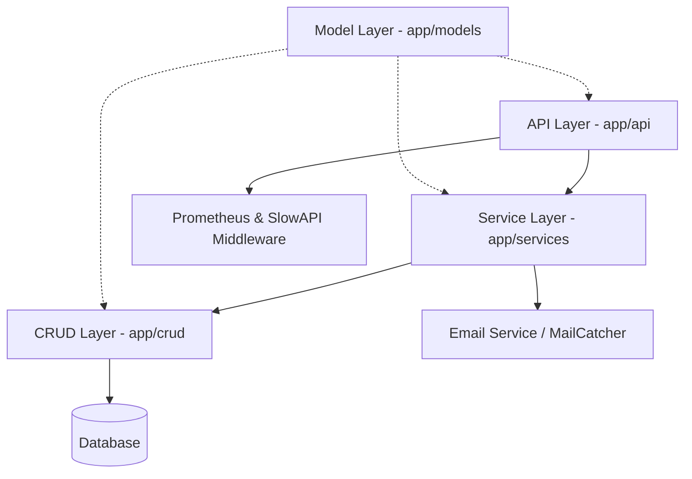

# Architecture

The project follows a **Layered Modular Architecture** designed for scalability, maintainability, and clear separation of concerns.

## 🏗️ Layered Structure

### 1. API Layer (`app/api/v1`)
- **Responsibility**: Request handling, validation, and response serialization.
- **Middleware**: Integrates `SlowAPI` (rate limiting) and `Instrumentator` (Prometheus metrics) to protect and monitor endpoints.

### 2. Service Layer (`app/services`)
- **Responsibility**: Business logic orchestration.
- **Role**: Coordinates multiple CRUD operations, external API calls, and domain-specific rules.

### 3. CRUD Layer (`app/crud`)
- **Responsibility**: Atomic database operations.
- **Role**: Reusable functions using **SQLModel** and **SQLAlchemy** (Async-ready).

### 4. Model Layer (`app/models`)
- **Responsibility**: Unified `SQLModel` definitions for Tables and DTOs.

## 🛡️ Observability & Resilience
- **Structured Logging**: `Structlog` provides unified JSON-formatted logs.
- **Error Tracking**: `Sentry SDK` captures and alerts on unhandled exceptions via native FastAPI integration.
- **Monitoring**: `Prometheus` metrics exposed at `/metrics` for real-time performance tracking.
- **Retry Logic**: `Tenacity` handles transient service failures.

## 🗄️ Database & Migrations
- **Database**: PostgreSQL 18.
- **Migrations**: **Alembic** for versioned schema management.

## 🔐 Security
- **Authentication**: OAuth2/JWT with HS256.
- **Hashing**: Argon2.
- **Security Linting**: `Bandit` runs on every commit via Prek.
