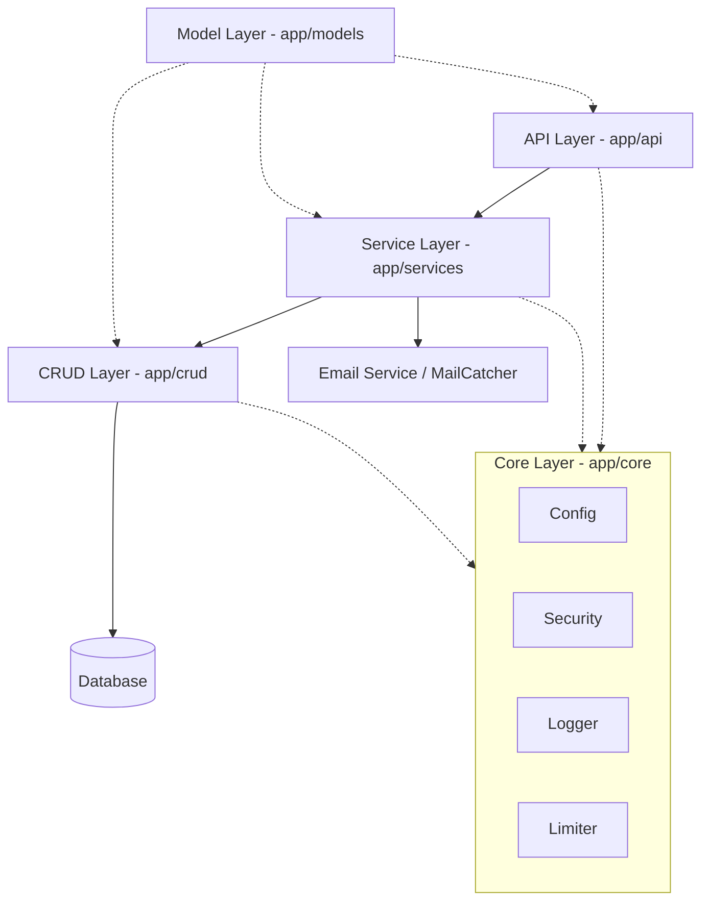

# Architecture

The project follows a **Layered Modular Architecture** designed for scalability, maintainability, and clear separation of concerns.

## 🏗️ Layered Structure

### 1. API Layer (`app/api/v1`)
- **Responsibility**: Request handling, routing, and response serialization.
- **Role**: Validates incoming data using Pydantic schemas and delegates business logic to the Service or CRUD layers.

### 2. Service Layer (`app/services`)
- **Responsibility**: Complex business logic orchestration.
- **Role**: Coordinates multiple CRUD operations, interacts with external APIs, and manages MJML email template rendering.

### 3. CRUD Layer (`app/crud`)
- **Responsibility**: Atomic, reusable database operations.
- **Role**: Direct interaction with the database using **SQLModel** and **SQLAlchemy** (Async-native).

### 4. Model Layer (`app/models`)
- **Responsibility**: Unified data definitions.
- **Role**: Defines `SQLModel` classes that serve as both database tables and Pydantic schemas (Read/Create/Update DTOs).

### 5. Core Layer (`app/core`)
- **Responsibility**: Cross-cutting concerns and global configuration.
- **Components**:
    - **Config**: Environment variable management via Pydantic Settings.
    - **Security**: JWT token handling, Argon2 password hashing, and authentication logic.
    - **Logger**: Centralized structured logging (Structlog + Rich).
    - **Limiter**: API rate limiting configuration (SlowAPI).

## 🛡️ Observability & Resilience
- **Structured Logging**: `Structlog` provides unified JSON-formatted logs.
- **Error Tracking**: `Sentry SDK` captures and alerts on unhandled exceptions via native FastAPI integration.
- **Monitoring**: `Prometheus` metrics exposed at `/metrics` for real-time performance tracking.
- **Retry Logic**: `Tenacity` handles transient service failures.

## 🗄️ Database & Migrations
- **Database**: PostgreSQL 18.
- **Migrations**: **Alembic** for versioned schema management.

## 🔐 Security
- **Authentication**: OAuth2/JWT with HS256.
- **Hashing**: Argon2.
- **Security Linting**: `Bandit` runs on every commit via Prek.
